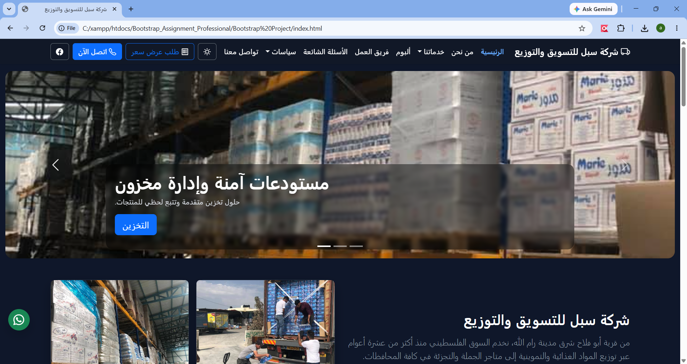

# Bootstrap Company Website

A responsive company website developed using Bootstrap 5 as part of a university assignment.

## Overview

This project represents a company website that includes multiple pages and responsive layouts suitable for desktop and mobile devices.

## Features

- Responsive design using Bootstrap 5
- RTL (Arabic) support
- Home page
- About page
- Contact page
- FAQ page
- Gallery/Album page
- Navigation bar
- Footer
- Responsive images
- Bootstrap components

## Technologies Used

- HTML5
- CSS3
- Bootstrap 5

## Project Structure
Bootstrap Project/
│
├── index.html
├── about.html
├── contact.html
├── faq.html
├── album.html
├── images/

## Screenshots

<table>
<tr>
<td align="center">
<b>الرئيسية</b> 

</td>
<td align="center">
<b>الرئيسية</b> 

</td>
<td align="center">
<b>الرئيسية</b> 

</td>
</tr>

<tr>
<td align="center">
<b>الرئيسية</b> 

</td>
<td align="center">
<b>الرئيسية</b> 

</td>
<td align="center">
<b>من نحن</b> 

</td>
</tr>

<tr>
<td align="center">
<b>من نحن </b> 

</td>
<td align="center">
<b>فريق العمل</b> 

</td>
<td align="center">
<b>طلب عرض سعر</b> 

</td>
</tr>
</table>
